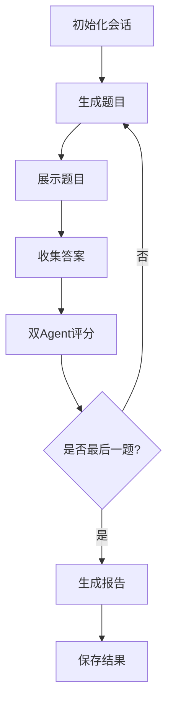

<<<<<<< HEAD
# 🎨 学生创造力测评系统

基于LangGraph的智能创造力评估平台，通过AI技术对学生进行多维度创造力测评，支持个性化学习路径和智能分析。

[](https://python.org)
[](https://streamlit.io)
[](https://github.com/langchain-ai/langgraph)
[](LICENSE)

## ✨ 项目特色

- **🧠 智能测评**：基于LangGraph工作流，实现动态题目生成和双Agent并行评分
- **📊 多维度评估**：从流畅性、灵活性、独创性、精细性四个维度全面评估创造力
- **📈 可视化分析**：提供雷达图、柱状图、趋势分析等多种可视化展示
- **🎯 个性化建议**：根据测评结果生成针对性的改进建议和学习路径
- **💾 数据管理**：完整的学生档案和测评结果管理系统
- **🔄 实时反馈**：逐题评分，即时反馈，提升学习体验
- **📱 响应式设计**：支持多设备访问，现代化用户界面

## 🚀 快速开始

### 环境要求

- Python 3.8+
- OpenAI API Key 或 SiliconFlow API Key
- 现代浏览器（Chrome、Firefox、Safari、Edge）

### 安装步骤

1. **克隆项目**
```bash
git clone <repository-url>
cd creativity-assessment-system
```

2. **安装依赖**
```bash
pip install -r requirements.txt
```

3. **配置环境变量**
```bash
# 复制环境变量模板
cp .env.example .env

# 编辑.env文件，添加你的API Key
# 支持OpenAI或SiliconFlow
OPENAI_API_KEY=your_openai_api_key_here
# 或者使用SiliconFlow
SILICONFLOW_API_KEY=your_siliconflow_api_key_here
SILICONFLOW_BASE_URL=https://api.siliconflow.cn/v1
SILICONFLOW_MODEL_CHAT=DeepSeek-V3
```

4. **启动应用**
```bash
# 方式1：使用脚本启动
python scripts/run.py

# 方式2：直接启动Streamlit
streamlit run src/app/app.py

# 方式3：后台运行
streamlit run src/app/app.py --server.headless true
```

5. **访问系统**
打开浏览器访问 `http://localhost:8501`

> 💡 **提示**：首次运行会自动初始化数据库和题库

## 📋 功能模块

### 🎯 1. 学生测评
- **智能信息录入**：学生档案创建与管理
- **动态题目生成**：基于LangGraph的智能出题
- **实时测评进度**：逐题评分，即时反馈
- **双Agent评分**：并行评分确保准确性
- **多题型支持**：发散思维、聚合思维、问题解决、想象力测试

### 📊 2. 结果分析
- **详细分析报告**：单次测评深度分析
- **趋势分析**：多次测评发展轨迹
- **可视化展示**：雷达图、柱状图、趋势图
- **个性化建议**：基于AI的改进建议
- **对比分析**：与同龄人水平对比

### 👥 3. 学生管理
- **档案管理**：完整的学生信息管理
- **历史记录**：所有测评记录追踪
- **数据导出**：CSV格式数据导出
- **统计分析**：班级、年级统计报告
- **批量操作**：支持批量数据处理

### ⚙️ 4. 系统设置
- **参数配置**：题目数量、时间限制等
- **模型配置**：支持多种AI模型切换
- **系统监控**：运行状态和性能监控
- **数据统计**：系统使用情况统计
- **日志管理**：详细的操作日志记录

## 🏗️ 系统架构

### 🔄 LangGraph工作流


### 🧩 核心组件
- **`creativity_graph.py`**: LangGraph工作流实现，双Agent评分系统
- **`analysis.py`**: 测评结果分析和可视化图表生成
- **`database.py`**: SQLite数据存储和管理
- **`models.py`**: Pydantic数据模型定义
- **`config.py`**: 系统配置和环境变量管理
- **`app.py`**: Streamlit Web界面和用户交互
- **`question_bank.py`**: 题库管理和题目生成
- **`logging_utils.py`**: 日志记录和监控

## 📊 测评维度

### 🚀 流畅性 (Fluency)
- **定义**：产生想法的数量和速度
- **评估**：答案的丰富程度和思维连续性
- **应用**：创意产出的效率评估

### 🔄 灵活性 (Flexibility)
- **定义**：思维角度的多样性和转换能力
- **评估**：不同类别想法的分布情况
- **应用**：跨领域思维能力的测量

### 💡 独创性 (Originality)
- **定义**：想法的独特性和创新程度
- **评估**：新颖性和非传统思维表现
- **应用**：创新潜力的识别

### 🎯 精细性 (Elaboration)
- **定义**：想法的详细程度和完整性
- **评估**：思维深度和细节丰富度
- **应用**：执行力和完善性评估

## 🎨 题目类型

### 🧠 1. 发散思维题 (Divergent Thinking)
- **特点**：要求尽可能多地列举用途或特征
- **示例**："请列举砖头的10种不同用途"
- **目标**：培养思维的广度和流畅性

### 🔗 2. 聚合思维题 (Convergent Thinking)
- **特点**：寻找不同事物的共同点或规律
- **示例**："苹果、橙子、香蕉有什么共同特征？"
- **目标**：提升逻辑思维和归纳能力

### 🛠️ 3. 创造性问题解决 (Creative Problem Solving)
- **特点**：设计创新解决方案
- **示例**："如何让城市更环保？"
- **目标**：培养实际应用能力

### 🌟 4. 想象力测试 (Imagination)
- **特点**：描述想象中的场景或故事
- **示例**："描述一个未来的学校"
- **目标**：激发想象力和创新思维

## 📈 可视化功能

### 📊 图表类型
- **🎯 雷达图**：展示各维度得分分布，直观显示能力轮廓
- **📊 柱状图**：对比各维度表现，支持颜色分级显示
- **📈 趋势图**：显示多次测评的发展轨迹
- **🔍 对比分析**：与同龄人水平进行对比

### 🎨 交互特性
- **悬浮提示**：鼠标悬停显示详细数据
- **缩放功能**：支持图表缩放和拖拽
- **导出功能**：支持PNG、SVG格式导出
- **响应式设计**：自适应不同屏幕尺寸

## 🔧 配置说明

### 🌐 环境变量
```env
# API配置（选择其一）
OPENAI_API_KEY=your_openai_api_key_here
# 或使用SiliconFlow
SILICONFLOW_API_KEY=your_siliconflow_api_key_here
SILICONFLOW_BASE_URL=https://api.siliconflow.cn/v1
#选择需要的llm
SILICONFLOW_MODEL_CHAT_A=Pro/deepseek-ai/DeepSeek-V3
SILICONFLOW_MODEL_CHAT_B=Pro/deepseek-ai/DeepSeek-V3.1

# 数据库配置
DATABASE_URL=sqlite:///./creativity_assessment.db

# 系统配置
DEBUG=True
MAX_QUESTIONS=10
TIME_LIMIT_MINUTES=30

# 日志配置
LOG_LEVEL=INFO
LOG_RETENTION_DAYS=7
```

### ⚙️ 测评参数
- **`MAX_QUESTIONS`**: 最大题目数量 (默认: 10)
- **`TIME_LIMIT_MINUTES`**: 时间限制 (默认: 30分钟)
- **`LOG_RETENTION_DAYS`**: 日志保留天数 (默认: 7天)

## 📝 使用指南

### 🎯 开始测评
1. **填写信息**：在"学生测评"页面填写学生基本信息
2. **开始测评**：点击"开始创造力测评"按钮
3. **逐题作答**：按顺序完成所有题目，系统实时评分
4. **查看结果**：测评完成后查看详细分析报告

### 📊 查看结果
1. **选择学生**：在"结果分析"页面选择要查看的学生
2. **选择测评**：选择具体的某次测评结果
3. **分析报告**：查看详细的多维度分析
4. **图表展示**：通过可视化图表了解表现
5. **获取建议**：查看个性化改进建议

### 👥 管理学生
1. **学生列表**：在"学生管理"页面查看所有学生
2. **历史记录**：查看每个学生的测评历史
3. **数据导出**：导出CSV格式的学生数据
4. **统计分析**：查看班级和年级统计信息

### ⚙️ 系统设置
1. **参数调整**：修改题目数量、时间限制等参数
2. **模型配置**：切换不同的AI模型
3. **系统监控**：查看系统运行状态和性能
4. **日志管理**：查看和下载系统日志

## 🚀 高级功能

### 🔄 双Agent评分系统
- **AgentA**：保守型评分，温度0，确保评分稳定性
- **AgentB**：发散型评分，温度0.3，鼓励创新思维
- **并行处理**：两个Agent同时评分，取平均值
- **容错机制**：单个Agent失败时使用另一个的结果

### 📊 智能分析（目前还未完全实现）
- **趋势预测**：基于历史数据预测创造力发展趋势
- **个性化建议**：根据测评结果生成针对性改进建议
- **对比分析**：与同龄人、同地区学生进行对比
- **异常检测**：识别需要特别关注的学生

### 🔧 系统监控
- **实时日志**：详细记录所有操作和评分过程
- **性能监控**：监控系统运行状态和响应时间
- **错误追踪**：自动记录和报告系统错误
- **数据备份**：自动备份重要数据

## 🤝 贡献指南

欢迎提交Issue和Pull Request来改进这个项目！

### 🛠️ 开发环境设置
```bash
# 克隆项目
git clone <repository-url>
cd creativity-assessment-system

# 安装开发依赖
pip install -r requirements.txt

# 运行测试
python tests/test_system.py

# 代码格式化
black .

# 类型检查
mypy src/
```

### 📋 开发规范
- 遵循PEP 8代码规范
- 添加适当的类型注解
- 编写单元测试
- 更新相关文档

## 📄 许可证

本项目采用MIT许可证 - 查看 [LICENSE](LICENSE) 文件了解详情。

## 🙏 致谢

### 🛠️ 技术栈
- [LangGraph](https://github.com/langchain-ai/langgraph) - 工作流框架
- [LangChain](https://github.com/langchain-ai/langchain) - LLM应用框架
- [Streamlit](https://streamlit.io/) - Web应用框架
- [Plotly](https://plotly.com/) - 数据可视化
- [SQLAlchemy](https://sqlalchemy.org/) - 数据库ORM
- [Pydantic](https://pydantic.dev/) - 数据验证

### 🎓 教育理论
- 吉尔福德创造力理论 (Guilford's Creativity Theory)
- 托兰斯创造力测试 (Torrance Tests of Creative Thinking)
- 发散思维与聚合思维理论

## 📞 联系方式

如有问题或建议，请通过以下方式联系：
- 📧 发送邮件至 [1260986446@qq.com]
- 🐛 提交Issue到GitHub仓库

**⚠️ 注意事项**：
- 使用本系统前请确保已获得相应的API Key
- 请遵守相关AI服务的使用条款和隐私政策
- 建议定期备份重要数据
- 如遇到问题，请查看日志文件或联系技术支持
=======
# creativity-assessment-agent
基于LangGraph的智能创造力评估平台，通过agent对学生进行多维度创造力测评
>>>>>>> 7afc16a29acb65ea26b5042d02a1a73ed3d2ee86
